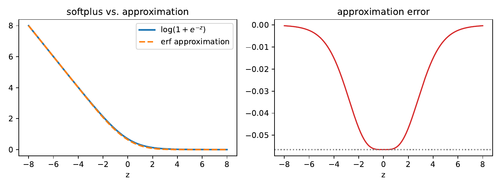
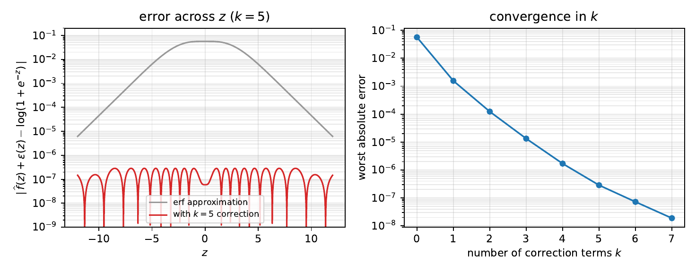
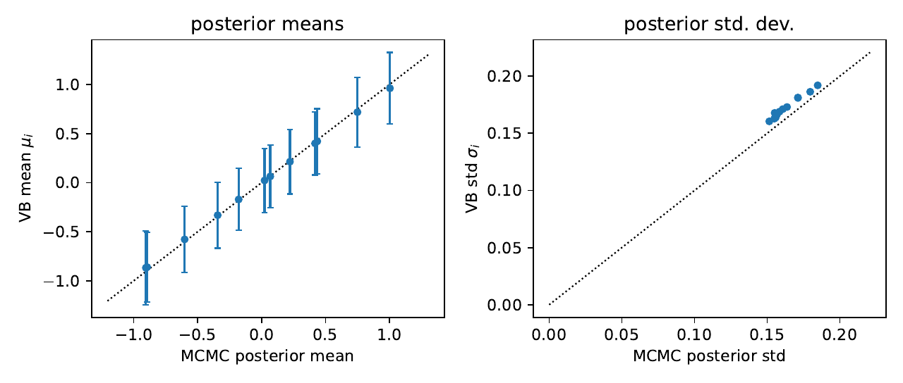
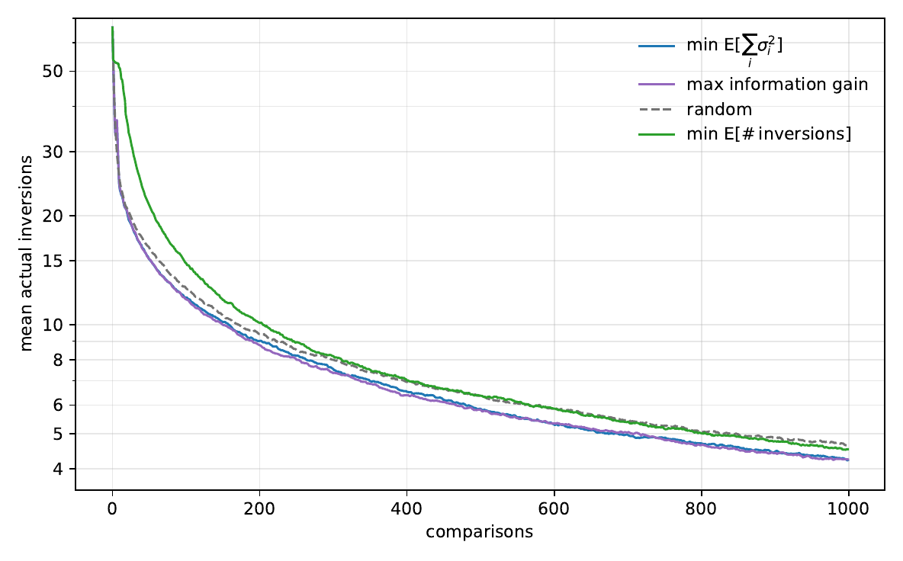

# Ranker

Bayesian ranking from pairwise comparisons — wins, losses, and (optionally) ties — using
mean-field variational Bayes with a **fully closed-form** objective, gradient, and Hessian.
No quadrature, no Monte Carlo in the inference loop: one carefully constructed error-function
approximation makes every integral analytic, and a small Gaussian-bump correction drives its
error down to ~3×10⁻⁷.

The write-up with all the derivations is in [`doc/ranker.pdf`](doc/ranker.pdf).

## The model

Each item `i` has a latent score `z_i ~ N(0, v)` with a shared scale `v ~ InvGamma(α, β)`;
item `i` beats item `j` with probability `σ(z_i − z_j)` (Bradley–Terry). The posterior is
approximated by independent normals over the scores plus an inverse-gamma over `v`, fitted by
minimizing the KL divergence (maximizing the ELBO) with a full Newton method.

The one integral that stands in the way is the expected softplus
`E[log(1 + e^{−δ})]` under a Gaussian `δ`. The trick: approximate the softplus by an
error-function expression whose Gaussian expectation is *exactly* of the same form —
the approximation commutes with the expectation.



The raw approximation is off by up to 0.0565. Adding `k = 5` even Gaussian bumps (whose Gaussian
expectations are also closed-form) reduces the worst-case error to **2.9×10⁻⁷**, leaving the
mean-field factorization itself as the only real approximation:



Against a long-run Metropolis sampler on the exact logistic model, the variational posterior's
means and (identified) standard deviations are essentially indistinguishable:



## Active selection

Because the objective is analytic, so is the sensitivity of the fit to a hypothetical next
comparison. The code selects the next pair to compare by expected information gain (or by the
predicted reduction in the sum of posterior variances, or in the expected number of ranking
inversions). An empirical surprise, detailed in the paper: information gain and variance
reduction win, while *greedily* minimizing expected inversions — the very metric being scored —
does worse than picking pairs at random.



## Ties

Comparisons can end in a draw. The extension uses the Davidson (1970) tie model, which adds a
single tie-propensity parameter `λ ≥ 0` (with `λ = 0` recovering Bradley–Terry exactly). The
prior is placed on the observable tie probability between equally matched items,
`p₀ = λ/(2+λ) ~ Beta(a, b)`, and the posterior over `λ` is a categorical over `J` atoms sitting
at the prior's quantiles. Two identities keep everything closed-form and fast:

- the Davidson log-normalizer decomposes exactly into softplus terms, so the same erf/bump
  machinery applies, and
- the mixture over atoms collapses into a single premixed kernel, so the per-pair cost is
  **independent of `J`**.

The atom table ships in [`fit_results/tie_atoms_J16.txt`](fit_results/tie_atoms_J16.txt) and can
be regenerated for any `J` or Beta prior with
[`python/fit_tie_atoms.py`](python/fit_tie_atoms.py).

## Try it — Python

The reference implementation is [`python/models.py`](python/models.py). It needs only NumPy and
SciPy. From the repo root:

```python
import numpy as np
from python.models import Model, VBayes

model = Model(12)          # 12 items; InvGamma(1.2, 2.0) prior on the score variance
inst = model.rvs()         # sample a ground-truth instance to play with
obs = inst.observe(300)    # 300 random comparisons -> sparse matrix of win counts

vb = VBayes(model)
vb.fit(obs, verbose=False)

print(np.argsort(-vb.μ()))          # ranking by posterior mean score
print(vb.σ())                       # per-item posterior uncertainty
print(vb.best_pair(obs))            # most informative pair to compare next
```

`obs` is any `scipy.sparse.coo_matrix` with `obs[i, j]` = number of times `i` beat `j`, so
plugging in real data is just building that matrix. With ties:

```python
vb = VBayes(model)
vb.enable_ties()                              # Davidson model, J=16 atoms
wins, ties = inst.observe_ties(400, λ=0.8)    # ties: upper-triangular tie counts
vb.fit(wins, tie_obs=ties, verbose=False)
print(vb.ties.E_λ())                          # posterior mean tie propensity
```

Tie-aware *active selection* currently lives in the C++ side only (`select_eig_ties`); the
Python `best_pair` and `KL` raise `NotImplementedError` when the tie model is enabled.

## Try it — C++

[`CC/ranker.cc`](CC/ranker.cc) is a self-contained fast implementation (Boost headers required),
kept in lock-step with the Python one (the test suite cross-checks the two implementations).

```sh
g++ -O3 -std=gnu++17 CC/ranker.cc -o CC/ranker -pthread
```

| mode | what it does |
| --- | --- |
| `./CC/ranker verify` | value / gradient / Hessian vs finite differences, plus the selection criteria |
| `./CC/ranker verify2` | active-selection tangent (marginal effect of a next comparison) vs finite differences |
| `./CC/ranker verify3 [atomfile]` | same checks with the tie model, plus a tie fit and 3-outcome EIG selection |
| `./CC/ranker bench <n> <comparisons>` | time a single fit |
| `./CC/ranker tiebench <n> <comparisons> <λ> [atomfile]` | time a tie-model fit |
| `./CC/ranker experiment <n> <steps> <nruns> <seed> <out.csv>` | the active-selection benchmark of the figure above (multithreaded) |

For scale: one core fits `n = 200` items with ~1.6×10⁵ comparisons in about 8 s (see the paper's
performance section).

## Layout

| path | contents |
| --- | --- |
| `python/models.py` | reference implementation: model, VB fit, active selection, ties |
| `CC/ranker.cc` | fast C++ implementation, verification and benchmark modes |
| `python/fit_correction.py` | fits the minimax Gaussian-bump correction coefficients |
| `python/fit_tie_atoms.py` | generates the tie-model atom table for any `J` and Beta prior |
| `fit_results/tie_atoms_J16.txt` | the shipped `J = 16` atom table (uniform prior on `p₀`) |
| `tests/test_ties.py` | unit / property tests: kernel freezes, FD checks, CAVI, cross-implementation |
| `doc/` | the paper (`ranker.tex`, built `ranker.pdf`, `make.sh`) |

Tests run with `pytest tests/` (~4 s; the cross-implementation test compiles the C++ if needed).
